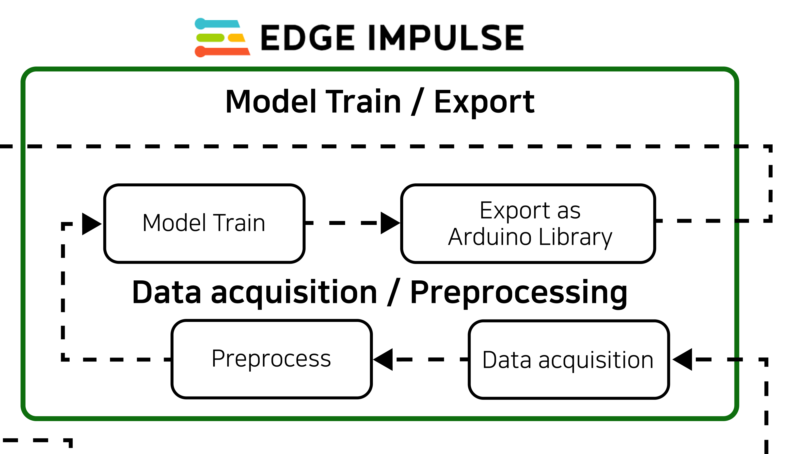

<h1>Edge-Computing</h1>
<h3>This repository contains the assignments and projects for the course Advanced Edge Computing (ECE7104) at Inha University.</h3>

<h2>System Diagram</h2>

Industrial Rotating Equipment Anomaly Vibration Detection System. This system uses vibration data from operational rotating machinery to identify equipment failure causes. It classifies the data into three categories: two anomalies and one normal condition.

<ul>
  <li>Imbalance: Uneven mass distribution in the shaft.</li>
  <li>Misalignment: Misalignment of the shaft.</li>
  <li>Normal: Normal operating condition.</li>
</ul>

Bluetooth communication enables real-time monitoring and visualization of the equipment's operational status.

<h2>Generate/Collect Data</h2>

We use the Machine Fault Simulator to generate vibrations by rotating a motor. The vibrations are captured using the Arduino Nano 33 BLE Sense equipped with a built-in IMU sensor.

During training, we transmit the collected data to the Edge Impulse project space via the Edge Impulse SDK.

<h2>Model Training and Export</h2>

Using Edge Impulse, we manage the collection and preprocessing of data for training. Post-training, the model is exported as an Arduino library for deployment.

<h2>Model Integration into Application</h2>

With the model exported as a library, we develop an application with Bluetooth functionality. The application is then built, deployed, and uploaded to the target device for seamless integration.

<h2>Real-Time Alarm/Monitor</h2>

Devices equipped with Bluetooth (We use Android Smartphone) receive and visualize the model's inference results in real-time, enabling immediate monitoring and alerting.

